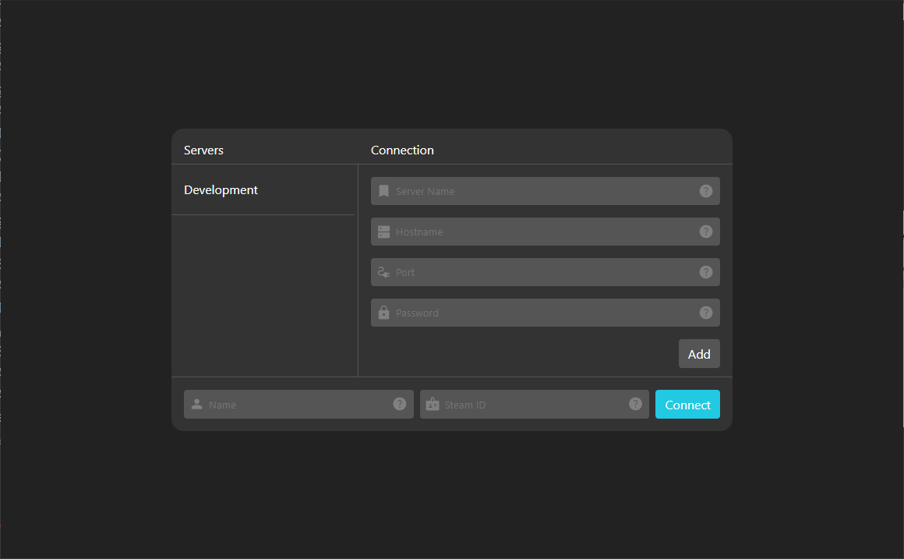
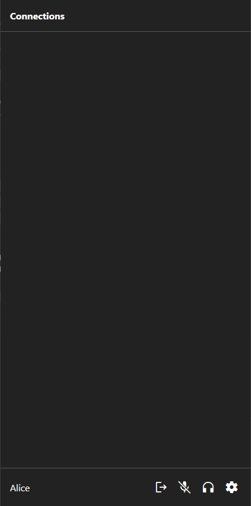
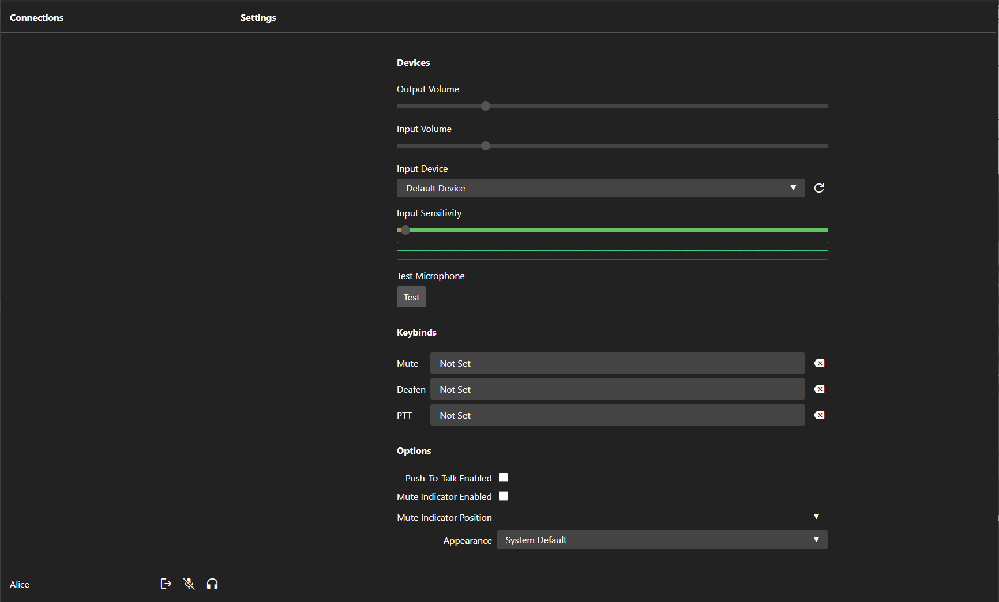

# Galactic Comms Voice Client
This repository holds the source code for the voice client for the GalacticComms Voice Plugin for [Space Engineers](https://www.spaceengineersgame.com/).

Its role is to allow users to connect to the voice network and provide an interface for users to modify their settings.

This is one of three parts that make up the system and should be installed on the **client side**.

The other parts can be found here:
- [The Torch Plugin](https://github.com/Someoneamzing/galactic-comms-plugin)
- [The Voice Server](https://github.com/Someoneamzing/galactic-comms-server)
- [The Voice Client (This Repo)](https://github.com/Someoneamzing/galactic-comms-client)

## Installation
For most users you'll just want to install the program. To do that just follow the steps below. For those who are interested in helping or have a bug to report check out [CONTRIBUTING.md]('./CONTRIBUTING.md).

> Note: This system is only available for Windows PC at the moment. This is mostly because Space Engineers is also Windows only. If someone wants to configure MacOS or Linux builds for the server or client, open an issue in the relevant repo. Unfortunately XBox support is unlikely due to the nature of modding and the permissions required for microphone access etc. 

1. To start you'll want to grab the latest release from the [Releases Page](https://github.com/Someoneamzing/galactic-comms-client/releases). To do that find the latest release and download the `GalacticComms Voice Client.zip` file.
2. Extract the contents into a folder where you want to store the program.
3. You can open the program by running `GalacticComms Voice Client.exe`.

> Note: You can create a shortcut easily by right clicking on the exe and selecting one of 'Pin to Start', 'Pin to Taskbar' or 'Send To > Desktop (Shortcut)'.

## Setup
Once the client is installed you can begin connecting. Before you begin make sure you have a dedicated server to join with the plugin installed and a voice server to connect to. Instructions for that can be found in the [Plugin Repo](https://github.com/Someoneamzing/galactic-comms-plugin) and [Server Repo](https://github.com/Someoneamzing/galactic-comms-server).

Open the client by running `GalacticComms Voice Client.exe` or through the shortcut you created if you did that. You should see a screen like the one below: 

Initially your server list will be empty. To add a server fill out the details under the connection section and select `Add` to save the server for later use. Information on what each field is can be seen by hovering over the question mark icon on the right of the field.

You should see the server appear in the list on the left, selected in blue. This list will hold all the servers you have saved for easy connection in the future. Simply select the server to auto fill the connection details.

Once that is done enter you name and Steam ID into the fields long the bottom. These will be saved independently of the server details so you'll only need to enter them once.

Once all the information is entered click `Connect`.

If the server you are connecting to is up and running and the details are correct you will be presented with a screen like either of the ones below, depending on the window size:

| Narrow Window | Wide Window |
| ------------- | ----------- |
|  |  |

The **Connections List** takes up most of the narrow window and sits on the left in wide windows. It shows the list of people currently connected to the voice network along with useful information about them like connection quality and volume controls.

The **Settings Panel** opened with the cog icon in the bottom right on narrow windows and visible on the right in wide windows provides access to configuration options such as input device, appearance and keybinds.

At the bottom of the connections list is your **Local Controls** showing your name. You can mute, deafen or leave the server.